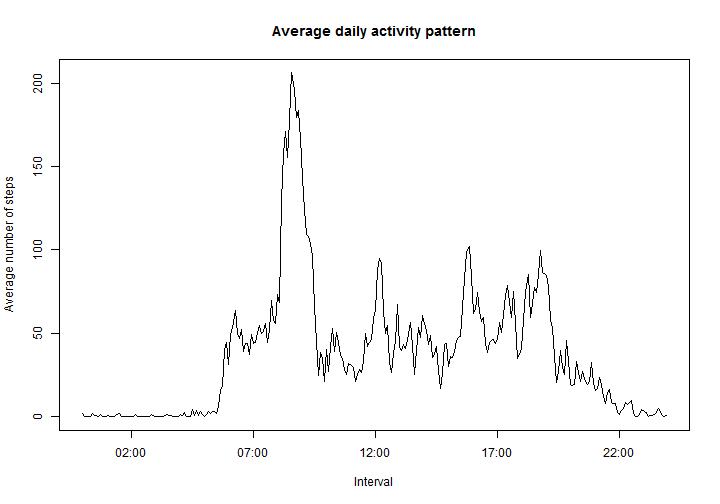

# Reproducible Research: Peer Assessment 1


## Loading and preprocessing the data
  
Download and unzip the required activity file.  
  

```r
# setInternet2 required to allow knitr to download from https site.
setInternet2(TRUE)

# Download and unzip file
download.file(url="https://d396qusza40orc.cloudfront.net/repdata%2Fdata%2Factivity.zip", destfile
               = "activity.zip", mode = "wb")
unzip("activity.zip")
```
  
Read in the activity.csv file.  
  

```r
df <- read.csv("activity.csv")
```
  
Converting the interval into POSIXlt format will assist with analysis and presentation.  
  
Therefore create two additional columns:  
1. intervalDateTime - combines the date and interval into a combined Date Time field.  
2. intervalTime - converts the interval into a 24hr time, each interval will have the Date component but only the time should be used.
  

```r
df$intervalDateTime <- strptime(paste(df$date, formatC(df$interval, width = 4, flag = "0"))
                                , format = "%Y-%m-%d %H%M")
df$intervalTime <- strptime(formatC(df$interval, width = 4, flag = "0"), format = "%H%M")
```
  
Using the aggregate functions create two datasets  
- dfDaily - contains the total number of steps for each day in the whole period.  
- dfInterval - contains both the mean and median steps for each interval across the whole period  
  
NOTE:
* The steps column in the dfInterval data frame is a list containing both the mean and median steps  
* NA values have been omitted
  

```r
# Daily steps dataset containing the total known number of steps taken each day
dfDaily <- aggregate(steps ~ date, data = df, sum, na.action = na.omit)

# Average (mean and median) steps taken for each of the intervals over the whole period 
dfInterval <- aggregate(steps ~ interval, data = df,
                        FUN = function(df) c(meanSteps = mean(df), medianSteps = median(df)), 
                        na.action = na.omit)
#Convert the interval into POSIXlt format
dfInterval$intervalTime <- strptime(formatC(dfInterval$interval, width = 4, flag = "0"), format = "%H%M")  
```


## What is mean total number of steps taken per day?

Generate a histogram to show the distribution of steps taken on each day.  


```r
hist(dfDaily$steps, breaks = 25, col = "blue", 
     main = "Histogram for the daily number of steps \n (excluding NA values)", 
     xlab = "Total number of steps"
     )
```

 


```r
meanDailySteps <- as.integer(round(mean(dfDaily$steps), 0))
medianDailySteps <- as.integer(round(median(dfDaily$steps), 0))
```

Mean daily steps is 10766  
Median daily steps is 10765

## What is the average daily activity pattern?

Using the dfInterval dataset created above it possible to generate a time series of the average steps in each of the intervals. The intervals have been converted to 24hr timestamps.   


```r
# Plot average daily patterns using the dfInterval summary dataset
# As the steps column in dfInterval is a list extract the meanSteps vector for this analysis
plot(dfInterval$intervalTime, dfInterval$steps[, "meanSteps"], type = "l", 
     main = "Average daily activity pattern",
     xlab = "Interval",
     ylab = "Average number of steps"
     )
```

 

```r
# Calculate max interval
maxInterval <- dfInterval$interval[which.max(dfInterval$steps)]

# Calculate max interval (in time format)
maxIntervalTime <- strftime(dfInterval$intervalTime[which.max(dfInterval$steps)], format = "%R %p")
```

The 5-minute interval that contains on average the maximum number of steps is 835 (08:35 AM).  

## Imputing missing values

Check for the total number of observations with missing steps.   


```r
cntStepsNAs <- sum(is.na(df$steps))
```

In total there are 2304 observations where the steps value is NA.  

We will then replace all the missing steps observations with that of the average number of steps for that interval (averaged across the whole period). 


```r
# Extract the mean steps for each interval 
dfIntervalMeans  <- data.frame(cbind(dfInterval$interval, dfInterval$steps[, "meanSteps"]))
names(dfIntervalMeans) <- c("interval", "meanSteps")

# Merge this dataset with the original dataset on the interval and replace missing steps observations
dfImputed <- merge(df, dfIntervalMeans, by = c("interval"))
dfImputed[(is.na(dfImputed$steps)), "steps"] <- dfImputed[(is.na(dfImputed$steps)), "meanSteps"]

# Remove the meanSteps column and reorder dataset
dfImputed$meanSteps <- NULL
dfImputed <- dfImputed[order(dfImputed$intervalDateTime), ]

# Check number of missing observations for steps
chkStepsNAs <- sum(is.na(dfImputed$steps))
```

After running this code there are now 0 obervations with NA for steps.  


```r
dfDailyImputed <- aggregate(steps ~ date, data = dfImputed, sum, na.action = na.fail)
```

As you would expect the main change to distribution is an increase in number of days with numbers of steps around 10,000 (the mean of the un-imputed dataset) 


```r
hist(dfDailyImputed$steps, breaks = 25, col = "blue",
     main = "Historgram for the daily number of steps \n (included imputed values)", 
     xlab = "Total number of steps",
     )
```

 

Replacing missing values with those of the average means that the the mean should remain largely the same.


```r
meanDailyImputedSteps <- as.integer(round(mean(dfDailyImputed$steps), 0))
medianDailyImputedSteps <- as.integer(round(median(dfDailyImputed$steps), 0))
```

Mean daily steps is 10766  
Median daily steps is 10766


## Are there differences in activity patterns between weekdays and weekends?

Using the day of the week from the date it is possible to determine if the activity took place on a weekday or a weekend.  


```r
# Calculate the weekday from the date
dfImputed$dayOfWeek <- as.factor(weekdays(as.Date(df$date)))

# Set weekday if dayOfWeek is not Saturday or Sunday
dfImputed[!(dfImputed$dayOfWeek %in% c("Saturday", "Sunday")), "wdayOrWend"] <- "weekday"

# Set weekend if dayOfWeek is Saturday or Sunday
dfImputed[dfImputed$dayOfWeek %in% c("Saturday", "Sunday"), "wdayOrWend"] <- "weekend"

# Set wdayOrWend as factor
dfImputed$wdayOrWend <- as.factor(dfImputed$wdayOrWend)
```

Summarise the activity during each interval between weekdays and weekends, again converting the interval to a 24hr timestamp.  


```r
dfIntervalWdayOrWend <- aggregate(steps ~ interval + wdayOrWend, data = dfImputed, mean, 
                                na.action = na.fail)
dfIntervalWdayOrWend$intervalTime <- as.POSIXct(strptime(formatC(dfIntervalWdayOrWend$interval
                                                      , width = 4, flag = "0"), format = "%H%M"))  
```

It is then possible to plot a panel plot to compare the two different activity patterns.  


```r
library(lattice)

xyplot(steps ~ intervalTime | wdayOrWend, data = dfIntervalWdayOrWend, type = "l", layout = c(1,2),
       scales = list(
               x = list(format = "%R")
               ),
       xlab = "Interval",
       ylab = "Average number of steps")
```

 

It is clear there is a difference between the daily patterns during weekdays and weekends. It would appear as though the largest difference is between working hours of approximately 9:00am to 5:00pm, in addition to a difference of steps during weekdays in the 1-2 hours leading up to 9:00am.
